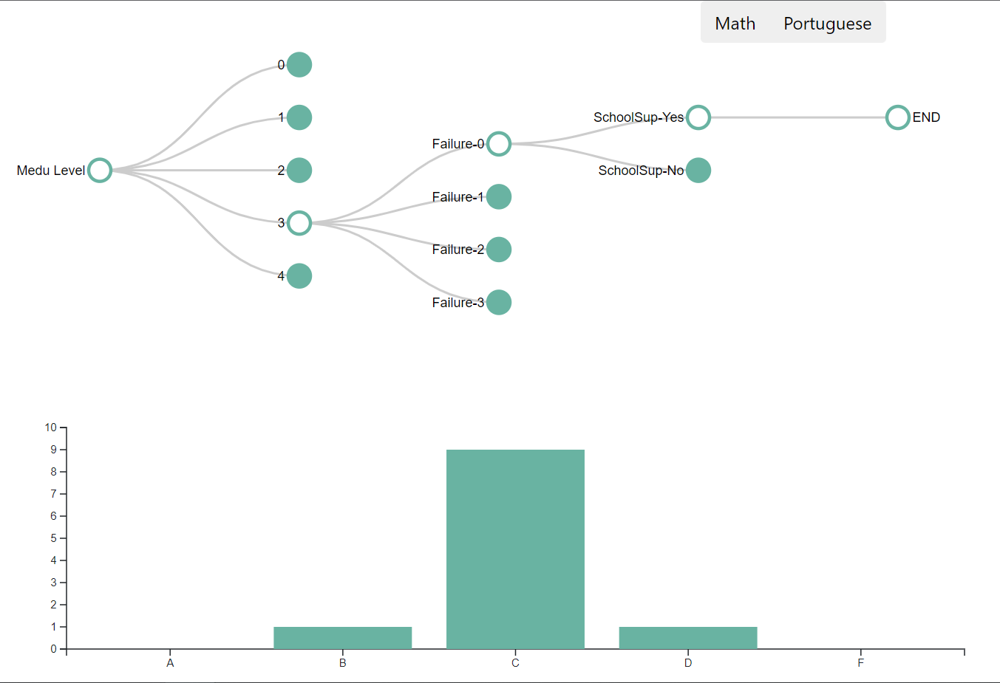

# Interactive component

## Link to the interactive graph
Click [here](https://rawcdn.githack.com/gbZachYin/StuPerfAnalysis/3ad151d391449183e57fb2b7bfa18392a36c2dd6/ic.html) or the link below: https://rawcdn.githack.com/gbZachYin/StuPerfAnalysis/3ad151d391449183e57fb2b7bfa18392a36c2dd6/ic.html

## Descriptions

The interactive component of the project is mainly built with d3.js version 6 and Danfo.js version 3.3. The former is for plot and the latter is for dataframe processing in JavaScript. The raw HTML code is uploaded to the project Github repo named [ic.html](https://raw.githubusercontent.com/gbZachYin/StuPerfAnalysis/main/ic.html). 
The collapsible tree and dynamic barchart below it display how the distribution of students' final letter grade varies as the tree structure changes.

## Instructions for using the plot

There are three deterministic variables (i.e. Mother’s education level, number of past class failures, and extra educational support) that have the strongest association with final grades regardless of the subject. The plot is initialized with all nodes being collapsed except for `Medu` in the tree and the distribution of all students' final grades for **Math** in the bar chart. 

1. Users can click the button at the top to choose the subject (Math or Portuguese). 
2. Users can either expand or collapse a certain node. 
3. The tree can be viewed as a filter. For instance, a tree with nodes failures-0 and SchoolSup-Yes expanded meaning that the final grade distribution for students who have no courses failed in the past and receive educational support are shown.

{width=95%}

References:

1. Mike Bostock: Collapsible Tree (https://bl.ocks.org/mbostock/4339083)

2. Danfo: powerful javascript data analysis toolkit (https://github.com/javascriptdata/danfojs)

3. Observable: d3-6.0 Migration Guide (https://observablehq.com/@d3/d3v6-migration-guide#events)
